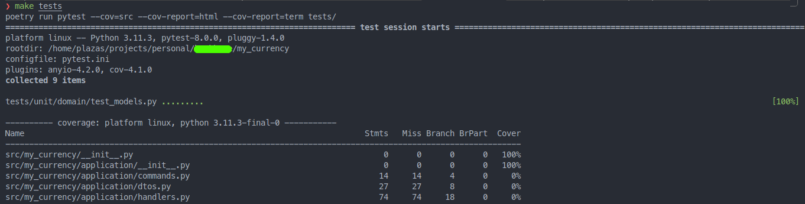
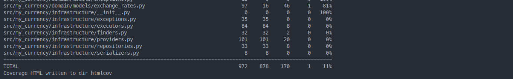

# My Currency App

# Introduction

For some time now, I've been deeply interested in software architecture. I've been involved in several projects where the primary challenge is code coupling. As the application grows beyond a proof of concept (PoC), certain tasks become overly complex to the point where starting from scratch seems more cost-effective than maintaining the existing application. However, I've also had the privilege of participating in projects where the scenario is quite the opposite. These are projects where the application architecture adapts to the application requirements, with low code coupling and the use of interfaces fostering the development of new functionalities.

Some time ago, I wanted to conduct a small experiment with a project, specifically with a Django application. The experiment aimed to use Django as a tool in the "Controllers" layer, leveraging its benefits and included batteries, while keeping the "business logic" (application layer) and application domain isolated. Recently, due to a challenge for a company, I've been incentivized to start a Django project and test out some ideas I've had.

My Currency is a Django application that essentially acts as a wrapper over some Fixer.io endpoints. Unfortunately, I haven't had much time and have only managed to implement the first use case:

- Querying exchange rates for different currencies within a specific time period.

As mentioned earlier, I wanted to develop an application using a layered architecture. To provide further context on what I intend to do, I'll reference an image from a Medium article titled ["DDD, Hexagonal, Onion, Clean, CQRS, … How I put it all together"](https://herbertograca.com/2020/08/13/ddd-hexagonal-onion-clean-cqrs-how-i-put-it-all-together/) by @hgraca, which I find very insightful.


The application has the following layers: Domain, Application, Controllers, and Infrastructure. In the Domain layer, the most abstract and internal layer, lie the application models. This layer is self-contained and does not depend on anything external to it. In the subsequent layer, the Application layer, I've defined all Ports (interfaces), Data Transfer Objects, Commands, and Handlers. This layer only knows about the code within its own layer and can additionally import and use elements from the Domain.

Commands, in the Application layer, reference the use cases and act as the drivers of the application. In this case, the GetCurrencyRatesByPeriodCommand contains all the necessary information to carry out the task. Each Command is associated, in a 1:1 relationship, with a Handler for each Command. The Handler knows all the logic to carry out the task along with the necessary tools. Everything is injected into this class through the constructor at application startup.

Further out, there is the Controllers layer, which in the previous diagram is referred to as Primary/Driving Adapters. It is in this layer where all the Interfaces defined in the Application layer are implemented (Adapters). This layer is the most susceptible to changes, as it communicates with the outside world. This is where the Django application resides. The inner layers know nothing about the outer layers, so the Application layer and the Domain layer know nothing about the Web framework used as the application driver. In this case, it's Django, but it could just as easily be FastAPI or a Console application.

Regarding Secondary Adapters or the infrastructure layer, these are the calls or actions triggered by the application layer to fulfill its tasks. In this case, all implementations of repositories (more on this in the book "Cosmic Python" [Chapter 2: Repository](https://www.cosmicpython.com/book/chapter_02_repository.html) --- Also in the book “Implementing Domain-Driven Design” Chapter 12 – Repositores) and finders are located in this layer. This is one of the biggest challenges when implementing this architecture with Django because it is both a Web Framework and an ORM, thus belonging to both the Controllers layer and the Infrastructure layer.

For further insights into repository patterns and their implementation, refer to the book "Implementing Domain-Driven Design" [Chapter 12 – Repositories].
This section elaborates on the role of Secondary Adapters and the Infrastructure layer in the My

Finally, I've created a package commonly referred to as `dependency_injection`. This package is responsible for two things: binding ALL commands with their respective Handler and creating, injecting and preparing all the instances that will be used by the Handlers to carry out their tasks.

This structure aims to foster modularity, maintainability, and scalability, allowing for easier testing, understanding, and modification of the codebase in the future.


## Improvements - next steps

### Tests
While the test coverage may currently appear low, the architecture and dependency injection greatly facilitate test development. For instance, each of the implemented Commands represents a specific use case, making it straightforward to write tests that cover individual use cases.

By structuring tests around these use cases, we can ensure that each aspect of the application's functionality is thoroughly tested. This approach not only improves the clarity and maintainability of the test suite but also enhances the overall reliability of the application.


Test piramid by Mike Cohn

### Plugeable Providers
The process for registering new Providers is not entirely automatic. While it allows for registering or removing Providers through the Django Admin, it's necessary for the implementations of the classes to be previously registered in the Container (dependency_injection package).

### Domain Layer
Currently, the Domain layer is not being utilized. In the Domain layer, with the assistance of ValueObjects, it's possible to validate low-level business rules. However, the application's models expressed in Django syntax (in models.py) are not related in any way to the models in the Domain Layer. This requires further investigation.


## Requirements

Basic requirements:

* Python ~3.11
* Django 4
* Django Rest Framework 3.14.0
* Whatever tool for dependency management tool, for example. I suggest Poetry.
* Make (optional): run `make help` to see available commands in the Makefile:
    - target: help - Display callable targets.
    - target: initdb - Initialize the database container
    - target: createdb - Create the Database
    - target: startdb - Start a postgres database for the my_currency
    - target: stopdb - Stop the my_currency postgres database
    - target: start - Start the apliaction using Docker containers
    - target: test - Run all available test
    - target: clean_pyc - Remove all ".pyc" files
    - target: createsuperuser - Create a super user account
    - target: shell_plus - Enter interactive environment
    - target: make-migrations - Create migration files
    - target: apply-migrations - Create migration files
    - target: lstart - Start the application locally
    - target: run - Executes any of the available django commands

## Quickstart

## ENV Variables

Project's configuration requires ENV variables. To help you setup the ENV files this project containst two example files:

* `.env_example`

These files contain the required ENV variables to work.

Now, please create a file called:
* `.env`

Copy the content:

* `.env_example` -> `.env`

And replace values that fit you requirements.

### Setup a virtual environtment.

This project contains a `pyproject.toml` that contains the project configuration and its dependencies.

**First time**

Select the python version. I recommend pyenv for managing pyhton versions but it is completly up to you how you install the required python version

```bash
# After installing the python version run the folloring command to select it.
pyenv shell 3.11.5

```

Create your virtual environment using the selected python version

```bash
poetry env use 3.11.5
```

Activate your virtual environment.

```bash
poetry shell
```

The following commnad will install the dependecies for development:

```bash
poetry install
```

## Start the project.

### Django service running locally and a Database Docker container (Development)

Create and initialize the local database:

```bash
docker run -d --name local_seb_db \
    -v seb_data:/var/lib/postgresql/data \
    -p 5432:5432 \
    -e POSTGRES_HOST_AUTH_METHOD=trust \
    postgres:15

# Or, using make
make initdb
```

```bash
docker exec -it seb_db createdb -U postgres seb
# Or, using make
make createdb
```

Start and stop the database container

```bash
docker start my_currency_db
# Or, using make
make startdb
```

```bash
docker stop my_currency_db
# Or, using make
make stopdb
```

Start the Django application

```bash
make lstart
```

## Pre-commit
This project comes with pre-commit configuration to ensure code quality with every commit. Upon each commit, "Flake8," "mypy," and "black" are executed against the `./src`  directory to ensure that the committed files comply with the defined quality standards.
```bash
# Enable pre-commit
poetry run pre-commit install
```

This setup helps maintain consistency and readability across the codebase, enhancing collaboration and reducing the likelihood of introducing errors.

# Available Endpoinds

**GET**
```bash
data/pandas/
```
Return a List of numbers in JSON format.

----------------------------

```bash
currencies/get_currencies_by_period/
```
POST

Accept data in JSON format as follows:
```python
{
    "source_currency": "EUR",
    "date_from": "2024-02-13",
    "date_to": "2024-02-14"
}
```

Response

```python
{
    "status_code": 200,
    "headers": {},
    "body": {
        "rates": [
            {
                "source_currency": "EUR",
                "exchange_currency": "CHF",
                "valuation_date": "2024-02-13T00:00:00",
                "rate_value": 0.950511
            },
            {
                "source_currency": "EUR",
                "exchange_currency": "USD",
                "valuation_date": "2024-02-13T00:00:00",
                "rate_value": 1.07095
            },
            {
                "source_currency": "EUR",
                "exchange_currency": "GBP",
                "valuation_date": "2024-02-13T00:00:00",
                "rate_value": 0.850602
            }
        ]
    }
}

```

## Handling External Providers

This endpoint utilizes a list of external providers sorted by priority. If one provider fails, the system tries the next one until all available providers are exhausted. Instances for each provider are created at runtime to ensure that any changes in the execution priority are taken into account for the next invocation.

```python
class ProviderManager(IProviderManager[IProvider[str, ExchangeRatesResponse, ProviderPriority]]):
    """
    ProviderManager class.

    This class manage all the operations related to providers.
    """

    _providers: Dict[str, Type[IProvider[str, ExchangeRatesResponse, ProviderPriority]]]
    _request_executor: IExecutor[HTTPRequest, HTTPResponse]
    _provider_finder: IProvidersFinder[str, ProviderDTO]
    _available_symbols: List[str]

    def __init__(
        self,
        providers: Dict[str, Type[IProvider[str, ExchangeRatesResponse, ProviderPriority]]],
        request_executor: IExecutor[HTTPRequest, HTTPResponse],
        provider_finder: IProvidersFinder[str, ProviderDTO],
        available_symbols: List[str],
    ) -> None:
        """Class constructor."""
        self._providers = providers
        self._request_executor = request_executor
        self._provider_finder = provider_finder
        self._available_symbols = available_symbols

    def get_providers(
        self,
    ) -> List[IProvider[str, ExchangeRatesResponse, ProviderPriority]]:
        """Return a list of available providers ordered by priority."""
        providers: List[IProvider] = []

        for provider_name, provider_cls in self._providers.items():
            # Get registered providers from the data base using the injected list of
            # available providers -> self._providers
            provider = self._provider_finder.get_by_name(name=provider_name)
            if provider is None:
                continue

            providers.append(
                # Dynamic instanciation of the Provider instance and passing it
                # a request executor to perform call to external APIs, all the
                # Other information is collected while registering the Provider
                # within the Django Admin.
                provider_cls(
                    request_executor=self._request_executor,
                    name=provider.name,
                    priority=provider.priority,
                    method=provider.method,
                    url=provider.url,
                    access_key=provider.access_key,
                    available_symbols=self._available_symbols,
                )
            )

        return sorted(providers, key=lambda provider: provider.priority)

```

This dynamic instantiation ensures flexibility and adaptability, allowing for seamless adjustments to the provider execution order without requiring modifications to the codebase.

As mentioned earlier, the logic and necessary classes to handle a command are injected into the Handlers at initialization time. It is precisely here where the `get_exchange_rate_data` function is called to fetch information about exchange rates.

```python
def get_exchange_rate_data(
    source_currency: str,
    valuation_date: str,
    provider: IProvider,
    exchange_courrency: Optional[str] = None,
) -> List[ExchangeRatesResponse]:
    """Retrive data from a third party provider."""
    if exchange_courrency is not None:
        return provider.get_currencies(
            source_currency=source_currency,
            valuation_date=valuation_date,
            exchange_courrency=exchange_courrency,
        )

    return provider.get_currencies(
        source_currency=source_currency, valuation_date=valuation_date
    )

```

As observed, this method only knows or is aware of the "**IProvider**" interface, allowing any implementation of this interface to be passed as a parameter. In this case, the FixerProvider and/or the MockProvider.

Currently, the system is designed to allow the registration of new providers via the Django admin interface. However, unfortunately, manual registration of the provider in the code is also required


```python
# Register new providers by its name and class
external_exchange_rates_providers = {"Fixer": FixerProvider, "Mock": MockProvider}

provider_manager = ProviderManager(
    providers=external_exchange_rates_providers,
    request_executor=executor,
    provider_finder=provider_finder,
    available_symbols=settings.AVAILABLE_EXCHANGE_SYMBOLS,
)

days_between_generator = DailyTimeSeriesGenerator()


class Container:
    """Container with all the dependencies."""

    handlers = {
        GetCurrencyRatesByPeriodCommand: GetCurrencyRatesByPeriodCommandHandler(
            executor=executor,
            provider_manager=provider_manager,
            exchange_rates_repository=exchange_rates_repository,
            exchange_rates_finder=exchange_rates_finder,
            get_exchange_rate_data=get_exchange_rate_data,
            available_currency_symbols=available_http_methods,
            days_between_generator=days_between_generator,
            exchange_rates_response_serializer=exchange_rates_response_serializer,
            currency_finder=currency_finder,
        )
    }

    dispatcher = Dispatcher(handlers=handlers)
```


This setup ensures flexibility and extensibility in adding new providers to the system while maintaining a clear separation of concerns between the application logic and provider implementation.

Finally, here's how the invocation of a command looks from the outermost layer of a command:

```python
class GetCurrenciesByPeriodView(APIView):
    """GetCurrenciesByPeriod class based view."""

    # Skip login
    permission_classes = [permissions.AllowAny]

    def get(self, request, format=None):
        """Handle a GET request."""
        print()
        return Response({})

    def post(self, request) -> Response:
        """Return a number list."""
        response_data = {"status_code": HTTPStatus.OK, "headers": {}, "body": {}}

        try:
            # Creating and validatin the incomming data using the Command
            get_currencies_by_period_command = GetCurrencyRatesByPeriodCommand(
                **request.data
            )
            # Passing the command to the Dispatcher
            rates = container.dispatcher.dispatch(
                command=get_currencies_by_period_command
            )
            response_data.update(
                {"body": {"rates": [asdict(exchange_rate) for exchange_rate in rates]}}
            )

        except Exception as error:
            logger.error("%s", error)
            response_data.update(
                {
                    "status_code": HTTPStatus.INTERNAL_SERVER_ERROR,
                    "body": {"error": "Unhandled error."},
                }
            )

        return Response(asdict(HTTPResponse(**response_data)))
```

The dispatcher receives the command find its handler an start handling the task:
```python
@dataclass
class Dispatcher:
    """Dispatcher class."""

    _handlers: Dict[type[ICommand], IHandler]

    def __init__(self, handlers: Dict[type[ICommand], IHandler]) -> None:
        """Dispacher class constructor."""
        self._handlers = handlers

    def dispatch(self, command: ICommand) -> Optional[Any]:
        """Dispatch the command to his handler."""
        logger.debug("Start dispatching the command: '%s'", command)
        # Get the handler based on a Command class
        command_handler = self._handlers.get(type(command))
        if command_handler:
            # Handle the incomming command
            result = command_handler.handle(command=command)
            logger.debug("Command '%s' successfully dispatched.", command)

            return result

        return None

    def __hash__(self) -> int:
        """
        Return the hash based on the command_handlers attribute.

        Returns
            int: hash
        """
        return hash(self._handlers)
```

As mentioned earlier, each command has an associated handler, and the dispatcher is responsible for dispatching the commands or tasks to their respective handlers.

# Running Tests


To execute the tests, simply run the following command:

```bash
make tests
```
The project's coverage is configured to be displayed both on the command line and in the web browser, making it easy to see the percentage of code covered.


...



The current coverage is quite low.
